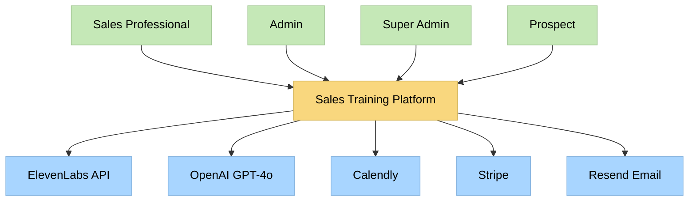
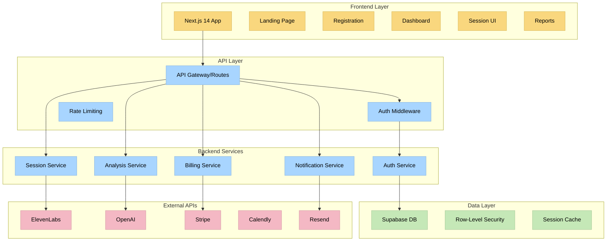
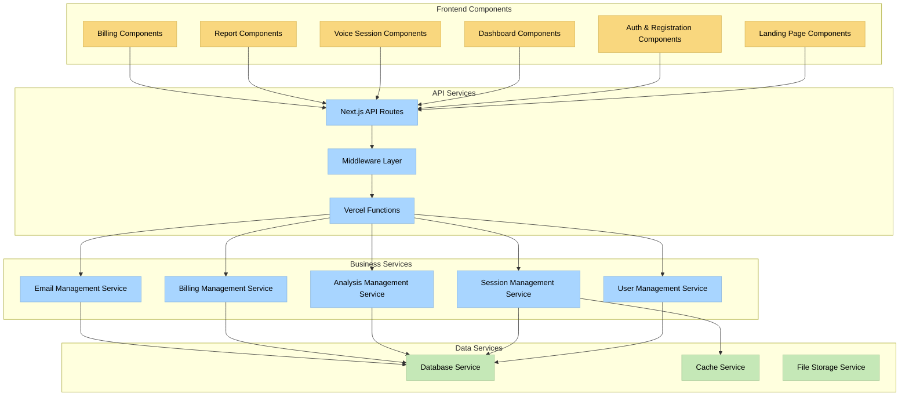
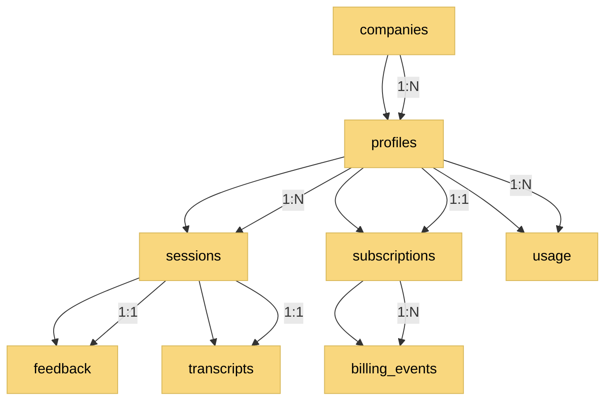
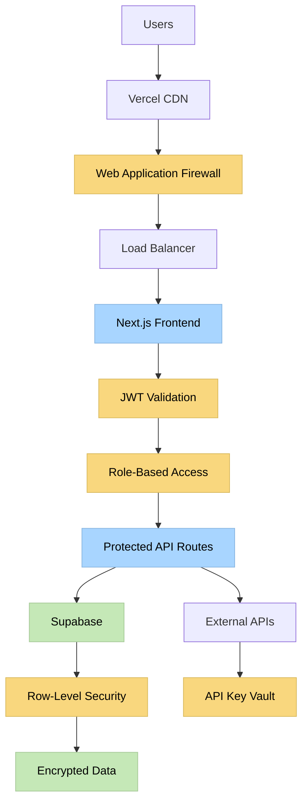
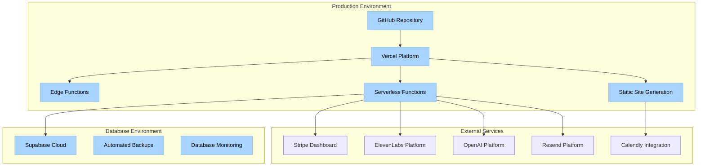

# Architectural Diagrams & Analysis

## System Context Diagram

## High-Level Architecture

## Component Architecture

## Data Architecture

## Security Architecture

## Deployment Architecture

